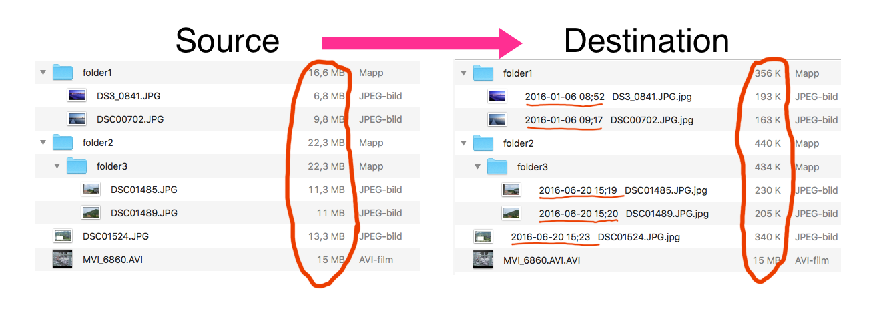

# ImageResizer

This is a Java tool for mapping/synchronizing a folder hierarchy into a new folder hierarchy with the following properties:
- Only images and videos are kept
- The exif date/time of images are prepended to their filename
- The images get down-scaled and compressed
- Only when something has changed is it transformed

The image displays an example run

The purpose of having the date/time prepended is to be able to sort images, from multiple cameras, by the time they were taken, without needing a special viewer software that can read exif tags. Windows Explorer or Finder is enough!

The purpose of compressing the images is so that it's faster to view and browse them over a network connection. On the internet as well as LANs.

This program is used for a real purpose by me. Once a week, a Raspbery Pi runs the program to transform our collection of family photos to the new form. We then view the transformed, not the original, photos on the TV. With the time in the filename, no advanced viewer software is needed to display the photos from different camers in the correct chronological order.

## Overview

- **How to use** How to compile and run the program.
- **Source code overview** A short overview of the classes and important methods.
- **Licenses and attribution** Licenses and attribution to third party libraries used in this project.
- **The "name" ImageResizer** About the name of the project.

## How to use

Make sure you are in the root directory of the project.

### Compile

To compile the program, you need to have `ant` installed.

- `ant clean` for cleaning the build directory.
- `ant compile` for compiling.
- `ant jar` for compiling and packaging into a `.jar` file.
- `ant` for all the above.

The final program will be in the `build/` directory and have the name `TheProgram.jar`.

If you don't want to compile the program yourself, a [pre-compiled jar is available for download](https://github.com/osklunds/ImageResizer/raw/master/misc/TheProgram.jar) in `misc/TheProgram.jar`.

### Run

The program is invoked as `java -jar TheProgram.jar src dst m1 m2 q` where

- `src` is the path to the source folder of images.
- `dst` is the path to the destination folder, where compressed images will be.
- `m1` is `1` if create/delete file messsages should be printed, otherwise `0`.
- `m2` is `1` if the folders entered and exited should be printed, otherwise is `0`.
- `q` is `M` (for mobile) or `T` (for TV).
  - In mobile, the images are capped at 1024x1024 and are compressed hard. Videos are not kept.
  - In TV, the images are capped at 1920x1080 and are compressed a little less hard. Videos are kept.

The `.jar` file can be moved to any folder.

## Source code overview

Class `Item`: A small class for storing a `File` object, a name and an extension of a file in the source or destination folder. Used in the iteration to see which files already exist.

Class `ImageTransform`: Used for representing an image that will be transformed. Has a source `File` object, a destination name and a destination folder `File` object.

Class `Iterator`: The main class of the program. It has the `main()` method to start the program as well as the `compute()` method, which is the core of the program.

Method `compute()`: This is the algorithm for synchronzing the source and destination folder hiearchies. The outline of it follows:

1. Generate a list of the items in the current source folder.
2. Generate a list of the items in the current destination folder.
3. Iterate over all items in the destination folder.
    * If the item is a folder and isn't contained in the source, *delete it*.
    * If the item is a file and isn't contained in the source, or isn't an image/a video, *delete it*.
4. Iterate over all items in the source folder.
    * If the item is a folder, *create it* and *continue recursively*.
    * If the item is a file, not in the destination folder.
        * If it's an image, create a transformed copy.
        * If it's a video, copy it.

## Licenses and attribution

This software uses third party libraries distributed under their own terms, see `LICENSES-3RD-PARTY.txt`. The third party libraries mentioned above are the following:

- Apache Commons IO: https://commons.apache.org/proper/commons-io/index.html
- metadata-extractor: https://github.com/drewnoakes/metadata-extractor
- Thumbnailator: https://github.com/coobird/thumbnailator

A big THANK YOU to them! Without their software, I couldn't have made this program. 

The binary forms of them are in the `lib/` folder. The files, as they are here, has not been modified at all, with one exception: for Apache Commons IO, I have put the original `docs/` folder into a corresponding `docs.zip` file.

## The "name" ImageResizer

The program is an image resizing program. The "name" ImageResizer is more like an adjective, describing what the progam does, rather than a name of it. By this, I mean that I don't want to infringe on anyone having the rights for the name ImageResizer.
